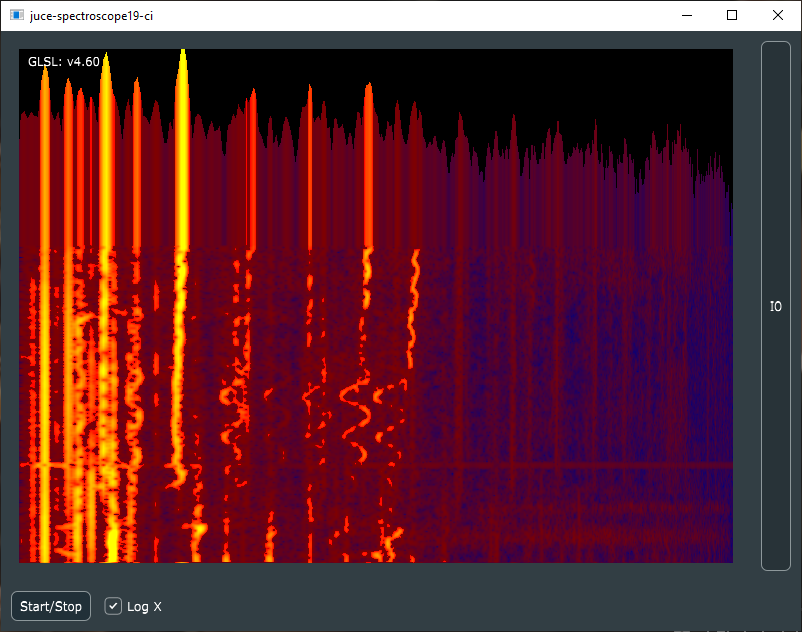

# Introduction

This is a standalone program to run the beautiful SpectrogramWidget of the [juce-spectroscope19](https://github.com/christofmuc/juce-spectroscope19) library. Go there if you want to include the widget in your own project, look here in this repository on how it is done. 

I also use this as a super-repository to document the use of the SpectrogramWidget including a proper build with git submodules, and hooking it into the appveyor CI.

## Example

Here is a screenshot of the program in action rendering a youtube video of a performance of [Pergolesi's Stabat mater](https://www.youtube.com/watch?v=FjJ02agjjdo):

## Usage

This repository allows us to build the demo of the SpectrogramWidget library independantly in an easy way. First checkout recursively:

    git clone --recurse-submodules -j8 https://github.com/christofmuc/juce-spectroscope19-ci.git
	
Then use CMake to build the makefile for Windows (use other generators as you see fit):

    cmake -S . -B Builds\Windows -G "Visual Studio 15 2017 Win64" 
	
Building with cmake:

    cmake --build Builds\Windows --config=Release

## Licensing

As some substantial work has gone into the development of this and related software, I decided to offer a dual license - AGPL, see the LICENSE.md file for the details, for everybody interested in how this works and willing to spend some time her- or himself on this, and a commercial MIT license available from me on request. Thus I can help the OpenSource community without blocking possible commercial applications.

## Contributing

All pull requests and issues welcome, I will try to get back to you as soon as I can. Due to the dual licensing please be aware that I will need to request transfer of copyright on accepting a PR. 

## About the author

Christof is a lifelong software developer having worked in various industries, and can't stop his programming hobby anyway. 
